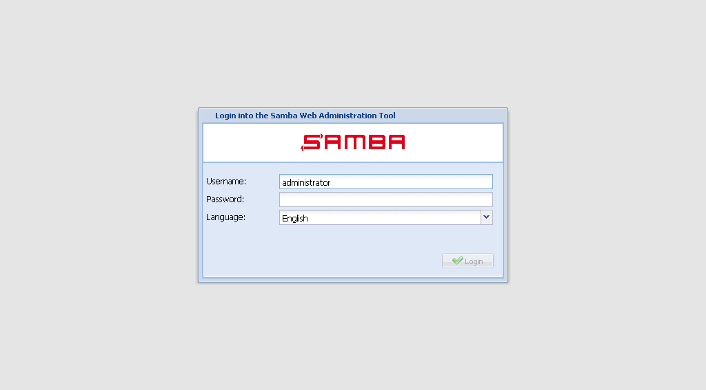

# SWAT2 is a Python frontend to Samba 4

A sleek and intuitive web-based tool for managing your Samba 4
Active Directory. Our tool boasts a modern design and user-friendly
interface that will make managing your AD a breeze. With just a few clicks,
you can add or remove users and groups, modify permissions, and configure 
domain settings.. Say goodbye to the  frustration of managing your Samba 4 AD
and hello to the ease and elegance of Samba4 AD Manager.



> This is a rewrite of the version created by Ricardo Velhote.

## Dependencies

- Samba4 (in particular, the Samba 4 Python bindings)
- pylons
- pam
- cjson
- jsonpickle

## Installation

On debian:

```bash
apt-get install python-pam python-cjson python-jsonpickle python-pylons
```

adding the following to the *[global]* section of the smb.conf file:

```conf
server services = +smb -s3fs
dcerpc endpoint servers = +winreg +srvsvc
```

## Standalone

```bash
git clone https://github.com/rnapoles/swat2.git
cd swat2/
```

#### Add the python binding for samba4

Example:
```bash
export PYTHONPATH=$PYTHONPATH:/usr/local/samba/lib/python2.6/site-packages/
export PATH=$PATH:/usr/local/samba/bin/:/usr/local/samba/sbin/
```

#### Use paster:
```bash
paster serve --reload development.ini &
```

This will initiate the Server at http://localhost:5001. 
You must authenticate with **root** for provision or with 
a valid Samba account for manage AD. Authentication will be performed 
using RPC, SAMR or PAM. 

#### Open the browser and put: 
```
http://server-ip:5001/
```

## Todo
- [x] Domain Provision
- [x] Manage Users
- [x] Manage Groups
- [ ] Manage Shares(There is a bug in Samba that prevents to do it.)
- [ ] Manage Computers
- [ ] Migrate to Flask